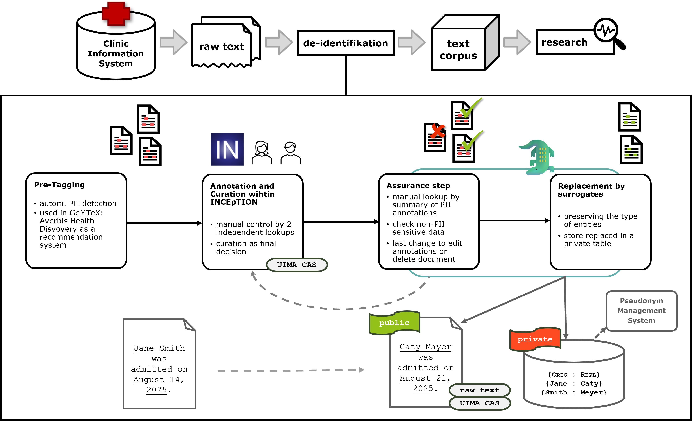

Surrogator 🐊
=============

**Content**

-   [Notes before Usage](#notes-before-usage)
    -   [Used PII Annotation Scheme](#used-pii-annotation-scheme)
    -   [De-Identification Workflow within the Surrogator](#de-identification-workflow-within-the-Surrogator)
    -   [Workflow of Surrogator](#workflow-of-surrogator)
        -   [Step 0: Input and Data Preparation](#step-0-input-and-data-preparation)
        -   [Step 1: Assurance step](#step-1-assurance-step)
        -   [Step 2: Surrogate](#step-2-surrogate)
-   [Configuration and Run](#configuration-and-run)
    -   [Preparation](#preparation)
    -   [Data before Usage](#data-before-usage)
        -   [Local Usage](#local-usage)
        -   [Run Step 1: task `quality_control`](#run-step-1-task-quality_control)
        -   [Run Step 2: task `surrogate`](#run-step-2-task-surrogate)
        -   [Run via Webservice](#run-via-webservice)
        -   [Remote Usage via Webservice](#remote-usage-via-webservice)
    -   [Docker Deployment](#docker-deployment)
        -   [General Docker Setup](#general-docker-setup)
        -   [Docker Sizing](#docker-sizing)
        -   [Docker Deployment](#docker-deployment-1)
        -   [Docker air-gapped setup](#docker-air-gapped-setup)
    -   [Contact](#contact)
        -   [More information about the GeMTeX\'s
            de-identification](#more-information-about-the-gemtexs-de-identification)


Notes before Usage
==================

This is the ***Surrogator***, a [Python](https://www.python.org)-based
framework designed to enhance privacy in German language clinical text
documents by replacing pre-annotated and pre-processed sensitive
information by replacing it with privacy-preserving placeholders.

The *Surrogator*\'s processes are based on pre-annotated PII (Personally
Identifiable Information) and was developed during the
[GeMTeX project](https://pubmed.ncbi.nlm.nih.gov/37203512/).
The input is build by pre-annotated PII annotations from the [INCEpTION
annotation plattform](https://github.com/inception-project/) within the
[UIMA Cas](https://uima.apache.org/d/uimaj-current/ref.html#ugr.ref.xmi)
format.
*UIMA Cas* is handled by
[*DKPro-cassis*](https://github.com/dkpro/dkpro-cassis) and also
[*PyCaprio*](https://pypi.org/project/pycaprio/).
We developed with versions 33 and 34 and have continuously adapted the tool to current versions (38) (11/2025).

Currently, the pipeline is designed to generate
placeholders / surrogates for these specific categories automatically.
Any remaining types of sensitive information are addressed manually during a
subsequent quality control step.

### Used PII Annotation Scheme

The used annotation scheme of the PII is based on the [GeMTeX
de-identification type-system
(annotation-layer)](https://github.com/medizininformatik-initiative/GeMTeX/tree/main/inception-projects):

1.  `NAME`
    -   `NAME_PATIENT`
    -   `NAME_RELATIVE`
    -   `NAME_DOCTOR`
    -   `NAME_EXT`
    -   `NAME_USERNAME`
    -   `NAME_TITLE`
2.  `DATE`
    -   `DATE_BIRTH`
    -   `DATE_DEATH`
    -   `DATE`
3.  `AGE`
4.  `LOCATION`
    -   `LOCATION_STREET`
    -   `LOCATION_CITY`
    -   `LOCATION_ZIP`
    -   `LOCATION_COUNTRY`
    -   `LOCATION_STATE`
    -   `LOCATION_HOSPITAL`
    -   `LOCATION_ORGANIZATION`
    -   `LOCATION_OTHER`
5.  `ID`
6.  `CONTACT`
    -   `CONTACT_PHONE`
    -   `CONTACT_EMAIL`
    -   `CONTACT_FAX`
    -   `CONTACT_URL`
7.  `PROFESSION`
8.  `OTHER`

In alignment with the [Datenschutz-Konzept of the
Medizininformatik-Initiative](https://www.medizininformatik-initiative.de/sites/default/files/2022-03/MII-Datenschutzkonzept_v1.0.pdf),
there is a specific focus on the following types of sensitive
information:

-   **Names**
-   **Date of Birth**
-   **Date of Death**
-   **Address details**
-   **Identifiers** (e.g., insurance numbers, patient IDs from the
    hospital information system)

De-Identification Workflow within the Surrogator
------------------------------------------------



1.  **Pre-Tagging**: Clinical documents are first pre-annotated by an
    automated system marking potential PII.
2.  **Manual Annotation and Curation**: A 2+1 review process is applied
    within the INCEpTION annotation platform. Two annotators
    independently review and correct the pre-annotations. Subsequently,
    a curator harmonizes the two versions, resolves discrepancies, and
    ensures the final, quality-assured annotation.
3.  **Export**: The completed annotation projects are exported from
    INCEpTION in the `UIMA CAS JSON` format. This format contains both
    the original text and the 7associated PII annotations with their
    types (e.g., `NAME PATIENT`, `DATE BIRTH`) and exact positions in
    the text.

Workflow of Surrogator
----------------------

### Step 0: Input and Data Preparation

-   The **annotations** from the de-identification process, along with
    their corresponding **curations**, are required.
-   Export the annotations of the full annotation project (it is adapted from the 
    [inception-reporting-dashboard](https://github.com/inception-project/inception-reporting-dashboard),
    do not use the **Curation Export Mode**) and ensure the format is set to `UIMA Cas JSON`.
-   Commandline and experimental mode allows the input of individual `UIMA Cas JSON` files. 
-   Example directory with 2 test projects [test\_data](test_data):
    -   edge case examples as plain text:
        [test\_data/deid-test-doc](test_data/deid-test-doc)

    -   2 test projects

        -   [test\_data/projects](test_data/projects) including 2
            INCEpTION importable projects as input for this surrogator
            pipeline
            1.  edge case snippets with annotations
            2.  GraSCCo with annotations

### Step 1: Assurance step

Before replacing sensitive entities in the text with surrogates, we
recommend conducting an **assurance step** / **quality control** step.
This ensures that all sensitive entity annotations are accurately processed and
appropriate surrogates can be generated. Some annotated entities may require manual
inspection.

#### Categories Automatically Handled by Replacement Modes

The following categories are automatically processed by all replacement
modes ([see supported modes](#run-step-2-task-surrogate)):

-   **`NAME`** (including all sub-categories)
-   **`DATE_BIRTH`** and **`DATE_DEATH`** (other `DATE` annotations are
    not prioritized during GeMTeX processing)
-   **`LOCATION`**
-   **`ID`**
-   **`CONTACT`**

#### Categories Requiring Manual Inspection

The following categories are summarized in a tabular structure and
require manual review. In certain cases, it may be necessary to exclude
a document from further processing if needed:

-   **`AGE`**: Any age above 89 should not permissible.
-   **`PROFESSION`**: This category may contain sensitive information if
    the individual has an identifiable job or is a public figure (e.g.,
    a mayor or minister).
-   **`OTHER`**: Requires review of the annotated document to ensure
    accuracy; annotations may need to be adjusted.
-   **`LOCATION_OTHER`**: This category may contain sensitive
    identifying information and should be carefully reviewed.

##### Examples of Lookups Using a Table Structure

Refer to the table structure with [example GraSCCo annotations (→
test\_data/export\_curated\_documents\_v2.zip](test_data/export_curated_documents_v2.zip):

-   A list with corpus\_details

-   A list with corpus documents

    1.  **Document List**: Lists all documents in the corpus.
    2.  **Inclusion Toggle**: Allows toggling documents between
        inclusion and exclusion from the corpus based on manually
        reviewed entities.
        -   Documents marked with `1` are included in the corpus for
            further processing.
        -   Documents with an `OTHER` annotation are automatically
            excluded and marked with `0`. This value can be manually
            adjusted if a document should be re-included.

    This table serves as the input for the subsequent surrogate step. It
    must be manually reviewed and adjusted as it determines which
    documents will proceed to the next processing stage and be part of
    the final corpus.

Example:

    
| document   | part_of_corpus |
|------------|----------------|
| Stölzl.txt | 1              |
| Rieser.txt | 1              |
| ...        | ...            |
| Meyr.txt   | 0              |
| Dewald.txt | 1              |

-   A list with statistics
-   Quality control json file
-   Summary with all the reports in (.md file)

The output of a quality control of a project is stored in a new created
directory like `private/private-'timestamp-key-of-run'/'project-name'`.

### Step 2: Surrogate

This pipeline provides the following modes, each offering a distinct
approach to replacing sensitive information with surrogates.

-   `gemtex` **→ suggested in GeMTeX**

    -   Placeholder notation for preserving identity without using real
        names
        -   Example:
            -   `Beate Albers` → `[** NAME_PATIENT FR7CR8 **]`
                -   `NAME_PATIENT` : entity
                -   `FR7CR8` : key

    `Wir berichten über lhre Patientin [** NAME_PATIENT FR7CR8 **] (* [** DATE_BIRTH 01.04.1997 **]), die sich vom 19.3. bis zum 7.5.2029 in unserer stat. Behandlung befand.`

    -   This mode supports reversing the surrogate replacement process.
        Each replaced entity is assigned a unique key that stores the
        original value. These mappings are saved in a `JSON` file,
        [example](test_data/test_output/private/deid-test-data_20250303-154154_key_assignment_gemtex.json)

        **Note: This file is critical and must not be deleted, as it
        will be required in a later step.**

```
      "Albers.txt": {
        "filename_orig": "Albers.txt",
        "annotations": {
          "NAME_PATIENT": {
            "WV7IT2": "Albers",
            "DU3DE3": "Beate Albers"
          },
          "DATE_BIRTH": {
            "01.04.1997": "4.4.1997"
          },
          "NAME_TITLE": {
            "EV2DL0": "Dr.med.",
            "AX9KF0": "Dr."
          },
          "NAME_DOCTOR": {
            "KS1EU0": "Siewert",
            "BW8TQ7": "Bernwart Schulze"
          }
        }
      },
```

-   `fictive`

    -   Surrogation via fictitious name replacements
        -   Example:
            -   `Beate Albers` → `Tina Schmitd`
                -   `NAME_PATIENT` : entity
                -   `Tina Smith` : key

    `Wir berichten über lhre Patientin Tina Schmitd (* 01.04.1997), die sich vom 12.3. bis zum 30.4.2029 in unserer stat. Behandlung befand.`

    -   This mode supports reversing the surrogate replacement process.
        Each replaced entity is also assigned a unique key that stores the
        original value. These mappings are saved in a `JSON` file.
    - For a detailed documentation of the replacement logic, see [doc/Surrogator_Technical_Description.pdf](doc/Surrogator_Technical_Description.pdf)


-   **Note**

    -   Every surrogate process is running with a quality control with
        all outputs.
    -   Documents with an `OTHER` annotation or a wrong annotation
        (marked as `NONE`) is excluded and not processed during the
        surrogate process!

-   The output of a run is stored in 2 ways:

    -   public files of a project are stored in a new created directory
        like `public/public-'timestamp-key-of-run'/'project-name'`
        -   all new created text files
    -   private files of a project are stored in a new created directory
        like `private/private-'timestamp-key-of-run'/'project-name'`.
        -   a directory with quality control of a run
        -   a directory with cas files

Configuration and Run
=====================

* Quick entry with [End-to-End example](End-to-End-Example.md)

Preparation
-----------

-   Install [Python 3.11](https://www.python.org);
-   It is preferred, to use a [virtual environment](https://docs.python.org/3/library/venv.html)
-   Install the following packages via [Pip](https://pypi.org/project/pip/), see [pyproject.toml](pyproject.toml) or run `pip install .`

```
        pandas~=2.2.2
        dkpro-cassis
        pycaprio~=0.3.0
        streamlit
        toml~=0.10.2
        mdutils~=1.6.0
        tabulate~=0.9.0
        streamlit_ext
        python-dateutil~=2.9.0
        requests~=2.32.3
        schwifty
        gender-guesser
        spacy
        joblib
        sentence-transformers
        Levenshtein
        scikit-learn
        openpyxl
        overpy
        anytree
```

-   usage with *docker*
    -   run `sudo docker build -t gemtex/surrogator:1.0.2 .`
    -   see images `sudo docker images`
    -   run `sudo docker compose -f docker-compose.yml up`


### Local Usage

-   Input: [zipped and *curated* INCEpTION annotation projects in 1 directory](https://inception-project.github.io/) with GeMTeX PII
    annotations, example: [test\_data/projects](test_data/projects)

### Run Step 1: task `quality_control`

-   Run: `python surrogator.py -qc -p path_to_projects` or

-   Run: `python surrogator.py --quality_control -p path_to_projects`

-   run quality control
    `python surrogator.py -qc -p test_data/projects`

-   Local run in a terminal:
    `python surrogator.py configs/parameters_quality_control.conf`

The output is stored in (created) directories:

-   `private` : archive @ Data Integration Center for every run a
    private directory is created, containing

    - the new created cas files in cas-project\_name-timestamp\_key
    - a directory with statistics of quality control output
    - for modes _gemtex_ and _fictive_ this repo contains 2 json files with the mapping
      of original PII and the surrogated PII:
        - nested version: 'common' json formatted file, example:
            ``
              "beruf_einrichtung.txt": {
                "filename_orig": "beruf_einrichtung.txt",
                "annotations": {
                  "NAME_PATIENT": {
                    "HP7SL6": "Andreas Fleischmann"
                  },
                  "LOCATION_ORGANIZATION": {
                    "PE8QX5": "Schlachhof Schlacht-Gut"
                  }
                }
              },
            ``
          - flatted version: no nesting, table formatted, better input for Pseudonym Management Tools
          ``
            "project-deid-test-data-1-2025-09-18-160813.zip-**-beruf_einrichtung.txt-**-NAME_PATIENT-**-HP7SL6": "Andreas Fleischmann",
            "project-deid-test-data-1-2025-09-18-160813.zip-**-beruf_einrichtung.txt-**-LOCATION_ORGANIZATION-**-PE8QX5": "Schlachhof Schlacht-Gut",
            "project-deid-test-data-1-2025-09-18-160813.zip-**-contact.txt-**-LOCATION_CITY-**-GT9GP1": "Leipzig",
          ``
-   `public` : for further usage (research, LLM training, semantic annotation, ...)

    -   only new generated text files from the projects

-   [test\_data](test_data/test_output) with `private` and `public`

### Run Step 2: task `surrogate`

-   Run with mode *x*
    `python surrogator.py -x -p path_to_projects`

-   Run with mode *entity*
    `python surrogator.py -e -p path_to_projects`

-   Run with mode *gemtex*
    `python surrogator.py -s -p path_to_projects`

-   Run with mode *fictive*
    `python surrogator.py -f -p path_to_projects`

    -   NOTE: if you want, that all `DATE` annotations (incl.
        `DATE_BIRTH` and `DATE_DEATH`) are shifted, use the
        extension `-d` and an integer value,
    -   example: `python surrogator.py -f -p path_to_projects -d 7` as a shift of seven days.
    -   If there is no shift defined, there is no shift processed
        and `DATE_BIRTH` and `DATE_DEATH` the first day of the
        quarter.
    -   If a date is not processable, the surrogate replacement is
        `DATE`.

-   NOTE: if there is a `UIMA Cas` file with annotations in your
    project path, files will be processed separately.

    -   example: `python surrogator.py -f -p path_to_projects` (see
        [`test_data/grascco_examples`](test_data/grascco_examples))

### Run via Webservice

-   Run: `python surrogator.py -ws` or
-   Run: `python surrogator.py --webservice`
-   [Here for more details of usage of Web Service.](Readme_Webservice.md)
-   **Note: We recommend processing only individual projects and reloading the browser after processing!**

### Remote Usage via Webservice (API Mode of Webservice)

-   Download [INCEpTION annotation plattform](https://inception-project.github.io/)
-   Extend `settings.properties` with `remote-api.enabled=true`, follow
    instruction for `ROLE_REMOTE` of the [admin guide of INCEpTION](https://inception-project.github.io/releases/38.0/docs/admin-guide.html)
-   Start INCEpTION.
-   Configure an INCEpTION project with users and documents, add
    `ROLE_REMOTE` in your INCEpTION project(s).
-   The remote usage is running also locally.


Docker Deployment
-----------------

### General Docker Setup

To deploy the application docker-compose or a docker binary, which is
modern enough to support the sub-command ``compose`` are required. The
docker setup consists of two containers:

-   ``gemtexsurrogator``: The application itself
-   ``overpass_api``: A local OpenStreetMap (OSM) server, which allows to
    query OSM maps without leaking information about the raw data to the
    internet.

### Docker Sizing

-   **50 GB Disk Space:** Mostly for OSM map data, peaks during initial
    import and for the models integrated in the docker image.
-   **8 GB RAM:** Mostly during initial data load of OSM.
-   **2 CPU cores:** The applications are mostly single-thread but will
    profit form a second core during database indexing.
-   **3 hours setup time:** The initial load of the Docker images and
    the map data takes about 10 min with 1 GBit/s internet connection.
    After that OSM container will run for multiple hours a process
    called ``update\database`` followed by a run of ``osm3s\query`` to
    import and index the data for later queries.

### Docker Deployment

To deploy with docker do this:

-   Build the image for the application container and note down the
    final image ID for tagging:


```
    $ docker build .
    
    => => writing image sha256:a429b43516db046d8e1a6ba5d8da46ebd6c4af1a85bdf983c4a2c017fb6a7b89
```
-   Tag the image with the name used in your [docker-compose.yml](docker-compose.yml), e.g.:


```
    $ grep image docker-compose.yml 
        image: gemtex/surrogator:1.0.2
        image: wiktorn/overpass-api:latest
    $ docker tag a429b43516db046d8e1a6ba5d8da46ebd6c4af1a85bdf983c4a2c017fb6a7b89 gemtex/surrogator:1.0.2
```
-   Run the containers:


```
    $ docker-compose up -d
```
On the first start the overpass-api will download and index its
database. This will take about 3 hours. On later restarts it will only
re-index its database for about 10 min. The application should ready and
operate a full speed once you see a message like this one:

    It took xxx to run the loop. Desired load is: 1%. Sleeping: yyyyy

To stop the application, go again to the folder containing the
docker-compose.yml and run:

```
    docker-compose stop
```
### Docker air-gapped setup

The above setup should also work for an air-gapped setup (tbc). However,
the images must be downloaded/pulled in advance on a system with
internet access. To build the gemtex/surrogator just execute
`docker build .` as described above. To pull overpass-api image run:
```
    docker pull wiktorn/overpass-api:latest
```
Now both images can be saved like this:
```
    docker save wiktorn/overpass-api:latest | gzip -c >overpass_image.tgz
    docker save gemtex/surrogator | gzip -c > gemtex_surrogater_image.tgz
```
The size of the images will be around 20 GByte in total. Both images can
be transferred to the air-gapped system by any means available and
loaded there using the `docker load < ...tgz` command.

Also, the initial loading of the maps folder of the maps folder can not
work for the air-gapped environment. So the maps folder must be copied
from a site with internet access after the initial load completed (about
3 hours). The maps folder has a size of about 16 GB.

Now the images can be tagged on the target system and `docker-compose`
works as described above.

### Further Notes

* The processing is logged. Log files stored under 'log' directory.
* The directory [resources](resources) contains resources used during processing.
  Do not delete this repo. It is filled during installation by load of language modes (SentenceTransformers and a spaCy based model.)

### More information about the GeMTeX\'s de-identification

-   Lohr C, Matthies F, Faller J, Modersohn L, Riedel A, Hahn U, Kiser
    R, Boeker M, Meineke F. [De-Identifying GRASCCO - A Pilot Study for
    the De-Identification of the German Medical Text Project (GeMTeX)
    Corpus.](https://pubmed.ncbi.nlm.nih.gov/39234720/) Stud Health
    Technol Inform. 2024 Aug 30;317:171-179. doi: [10.3233/SHTI240853](doi.org/10.3233/SHTI240853).
    PMID: [39234720](https://pubmed.ncbi.nlm.nih.gov/39234720/).
-   Lohr C, Faller J, Riedel A, Nguyen HM, Wolfien M, Hofenbitzer J,
    Modersohn L, Romberg J, Prasser F, Omeirat J, Wen Y, Galusch O, Hahn
    U, Seiferling M, Dieterich C, Klügl P, Matthies F, Kind J, Boeker M,
    Löffler M, Meineke F. [GeMTeX\'s De-Identification in Action:
    Lessons Learned & Devil\'s
    Details.](https://pubmed.ncbi.nlm.nih.gov/40899551/) Stud Health
    Technol Inform. 2025 Sep 3;331:274-282. doi: [10.3233/SHTI251406](doi.org/10.3233/SHTI251406).
    PMID: [40899551](https://pubmed.ncbi.nlm.nih.gov/40899551/).


Contact
-------

If you have further questions, do not hesitate to contact [Christina Lohr](mailto:christina.lohr@imise.uni-leipzig.de).

Last edit: 2025/11/14.
