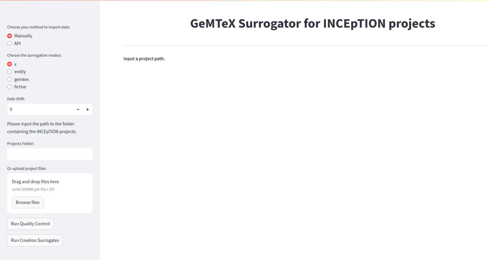
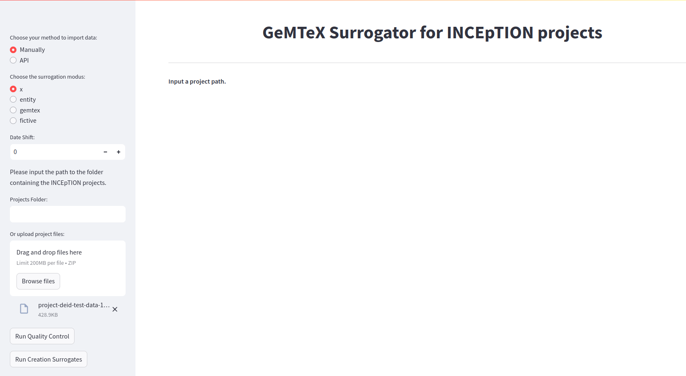
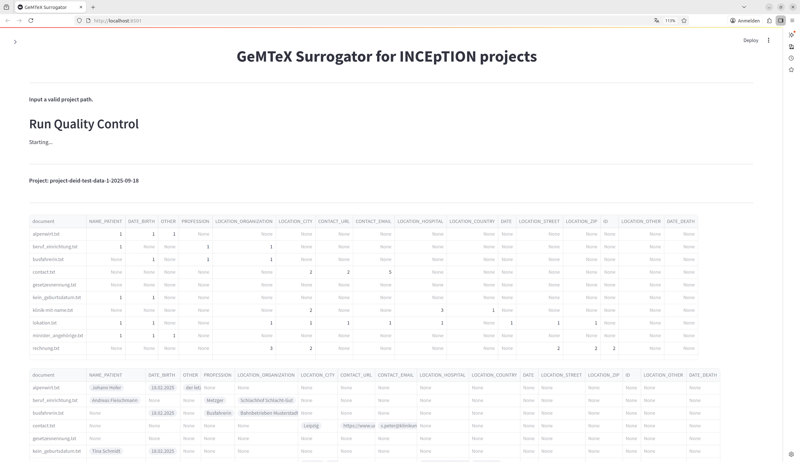
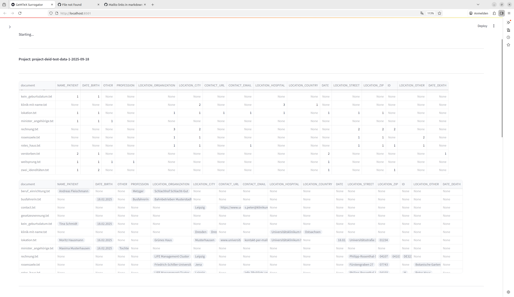
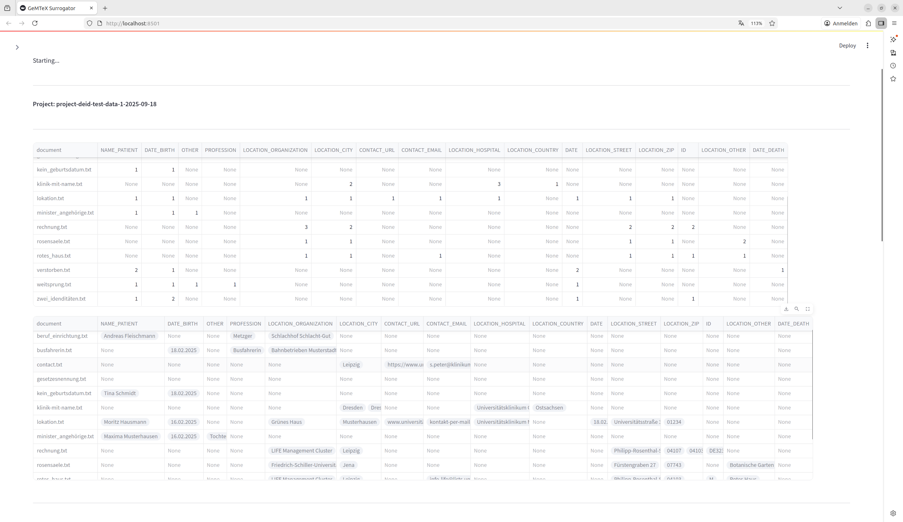
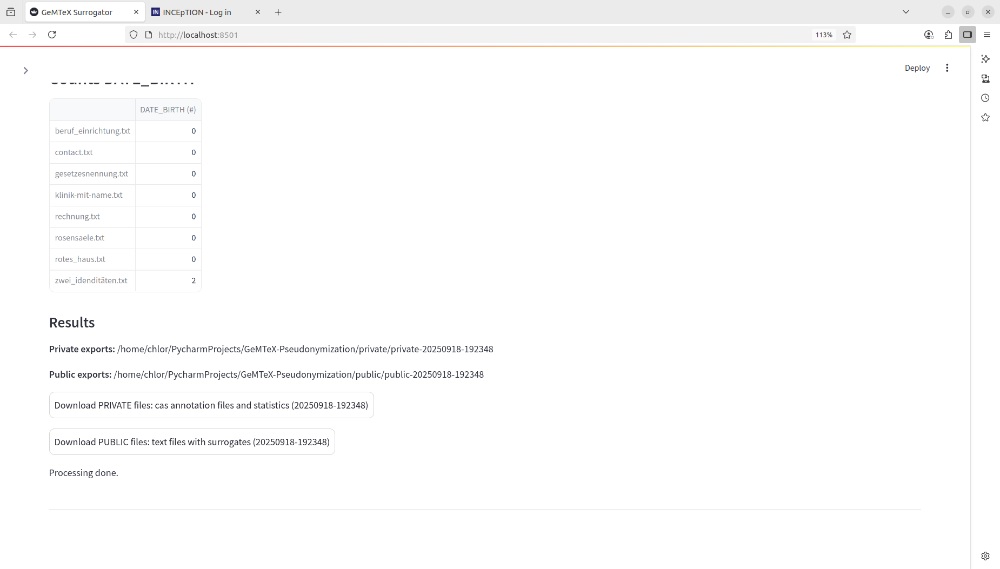

Surrogator's Webservice
=======================

### Start
-   Run: `python surrogator.py -ws` or
-   Run: `python surrogator.py --webservice`

Screenshot after start (remote or local)

### Local Usage 

* use drag and drop with exported INCEpTION projects [(example project)](test_data/projects/project-deid-test-data-1-2025-09-18-160813.zip) or 
* input the place of the path with exported INCEpTION projects (example `test_data/projects`)

### Remote Usage API Mode

-   Download [INCEpTION annotation plattform](https://inception-project.github.io/)
-   Extend `settings.properties` with `remote-api.enabled=true`, follow
    instruction for `ROLE_REMOTE` of the [admin guide of INCEpTION](https://inception-project.github.io/releases/38.0/docs/admin-guide.html)
-   Start INCEpTION.
-   Configure an INCEpTION project with users and documents, add
    `ROLE_REMOTE` in your INCEpTION project(s).
-    The remote usage is running also locally.
-    Use the ip address from INCEpTION as input of the webservice and your login from INCEpTION. 

**After successful import, use the web service and run Quality Control or Surrogation and choose your preferred mode before!**

### Quality Control (Assurance Step)

The Quality Control (Assurance Step) summarizes the annotations in table formatted form:

### Surrogation

The output of the surrogation process consists of the download buttons of the PUBLIC archvie and the PRIVATE archive.

**Note**

* We recommend processing only individual projects and reloading the browser after processing!

